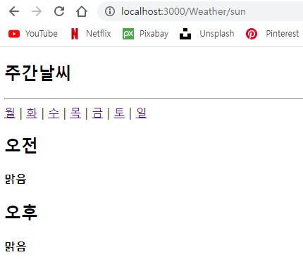
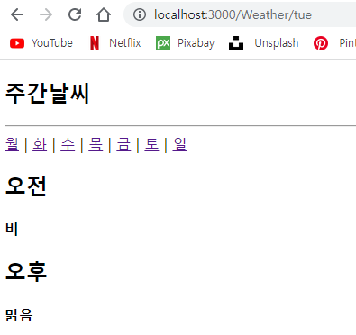

# 권채림 컴포넌트 연습문제

> 2022-10-18

## 문제1

### index.js
```javascript
import React from 'react';
import ReactDOM from 'react-dom/client';
import App from './App';
import { BrowserRouter } from 'react-router-dom';


const root = ReactDOM.createRoot(document.getElementById('root'));
root.render(
  <BrowserRouter><App /></BrowserRouter>
);

```

### App.js
```javascript
import React from "react";
import { Link , Routes, Route} from "react-router-dom";
import Weather from "./Weather";

function App() {
  return (
    <div>
      <h2>주간날씨</h2>
      <hr />

      <nav>
        <Link to="/Weather/mon">월</Link>&nbsp;|&nbsp;
        <Link to="/Weather/tue">화</Link>&nbsp;|&nbsp;
        <Link to="/Weather/wed">수</Link>&nbsp;|&nbsp;
        <Link to="/Weather/thu">목</Link>&nbsp;|&nbsp;
        <Link to="/Weather/fri">금</Link>&nbsp;|&nbsp;
        <Link to="/Weather/sat">토</Link>&nbsp;|&nbsp;
        <Link to="/Weather/sun">일</Link>
      </nav>

      <Routes>
        <Route path="/Weather/:day" element={<Weather/>} exact={true} />
      </Routes>

    </div>
  );
}

export default App;

```

### Weather.js
```javascript
import React from 'react';
import { useParams } from 'react-router-dom';

const Weather = () => {
    console.clear();
    const params = useParams();
    // console.log(params)

    const weather = {
        "mon": ["맑음", "맑음"],
        "tue": ["비", "맑음"],
        "wed": ["맑음", "흐림"],
        "thu": ["맑음", "흐림"],
        "fri": ["흐림", "흐림"],
        "sat": ["비", "맑음"],
        "sun": ["맑음", "맑음"]
    };

    const dayWeather = weather[params.day];
    // console.log(dayWeather)

    return (
        <div>
            <h2>오전</h2>
            <h4>{dayWeather[0]}</h4>
            <h2>오후</h2>
            <h4>{dayWeather[1]}</h4>
        </div>
    )
};

export default Weather;
```


