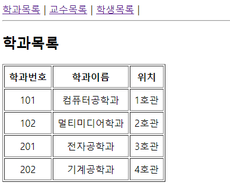
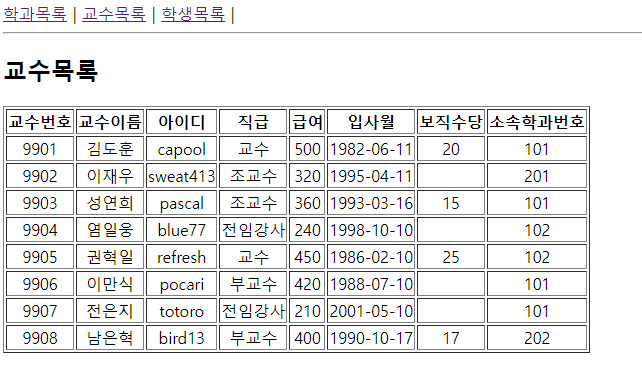
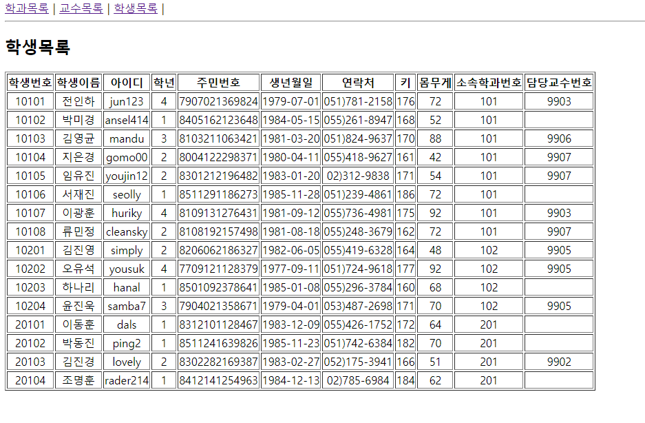

# 권채림 03-jsx 연습문제

> 2022-10-19

## 문제1
### APP.js
```javascript
import React from "react";
import { Link, Routes, Route } from "react-router-dom";
import Department from "./pages/Department";
import Professor from "./pages/Professor";
import Student from "./pages/Student";


function App() {
  return (
    <div>
      <nav>
        <Link to='/department'>학과목록</Link>&nbsp;|&nbsp;
        <Link to='/professor'>교수목록</Link>&nbsp;|&nbsp;
        <Link to='/student'>학생목록</Link>&nbsp;|&nbsp;
      </nav>
      <hr />

      <Routes>
        <Route path="/department" element={<Department/>}/>
        <Route path="/professor" element={<Professor/>}/>
        <Route path="/student" element={<Student/>}/>
      </Routes>
    </div>
  );
}

export default App;

```
### Department.js
```javascript
import React from 'react';
import Data from '../Data';

const Department = () => {
    return (
        <div>
            <h2>학과목록</h2>
            <table border="1" cellPadding="7">
                <thead>
                    <tr align="center">
                        <th>학과번호</th>
                        <th>학과이름</th>
                        <th>위치</th>
                    </tr>
                </thead>
                <tbody>
                    {Data.department.map((v, i) => {
                        return (
                            <tr align="center" key={i}>
                                <td>{v.id}</td>
                                <td>{v.dname}</td>
                                <td>{v.loc}</td>
                            </tr>
                        )
                    })}
                </tbody>
            </table>
        </div>
    )
};

export default Department;
```
### Professor.js
```javascript
import React from 'react';
import Data from '../Data';

const Professor = () => {
    return (
        <div>
            <h2>교수목록</h2>
            <table border="1" cellPadding="1">
                <thead>
                    <tr align="center">
                        <th>교수번호</th>
                        <th>교수이름</th>
                        <th>아이디</th>
                        <th>직급</th>
                        <th>급여</th>
                        <th>입사월</th>
                        <th>보직수당</th>
                        <th>소속학과번호</th>
                    </tr>
                </thead>
                <tbody>
                    {Data.professor.map((v, i) => {
                        return (
                            <tr align="center" key={i}>
                                <td>{v.id}</td>
                                <td>{v.name}</td>
                                <td>{v.userid}</td>
                                <td>{v.position}</td>
                                <td>{v.sal}</td>
                                <td>{v.hiredate.substring(0,10)}</td>
                                <td>{v.comm}</td>
                                <td>{v.deptno}</td>
                            </tr>
                        )
                    })}
                </tbody>
            </table>
        </div>
    )
};

export default Professor;

```
### Student.js
```javascript
import React from 'react';
import Data from '../Data';


const Student = () => {
    return (
        <div>
            <h2>학생목록</h2>
            <table border="1" cellPadding="1">
                <thead>
                    <tr align="center">
                        <th>학생번호</th>
                        <th>학생이름</th>
                        <th>아이디</th>
                        <th>학년</th>
                        <th>주민번호</th>
                        <th>생년월일</th>
                        <th>연락처</th>
                        <th>키</th>
                        <th>몸무게</th>
                        <th>소속학과번호</th>
                        <th>담당교수번호</th>
                    </tr>
                </thead>
                <tbody>
                    {Data.student.map((v, i) => {
                        
                        return (
                            <tr align="center" key={i}>
                                <td>{v.id}</td>
                                <td>{v.name}</td>
                                <td>{v.userid}</td>
                                <td>{v.grade}</td>
                                <td>{v.idnum}</td>
                                <td>{v.birthdate.substring(0,10)}</td>
                                <td>{v.tel}</td>
                                <td>{v.height}</td>
                                <td>{v.weight}</td>
                                <td>{v.deptno}</td>
                                <td>{v.profno}</td>
                            </tr>
                        )
                    })}
                </tbody>
            </table>
        </div>
    )
};

export default Student;

```



