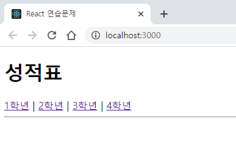
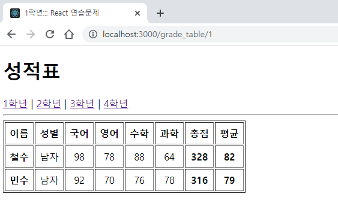
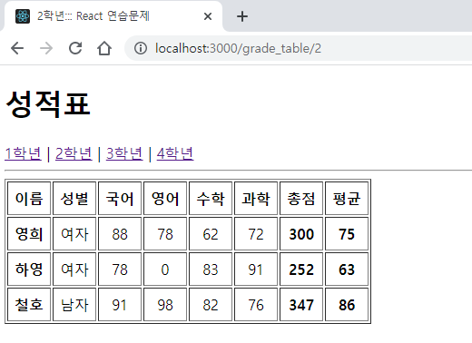
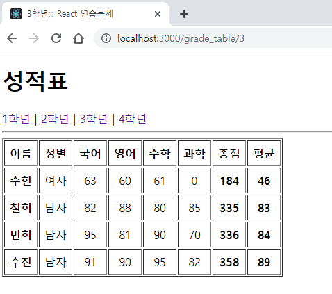
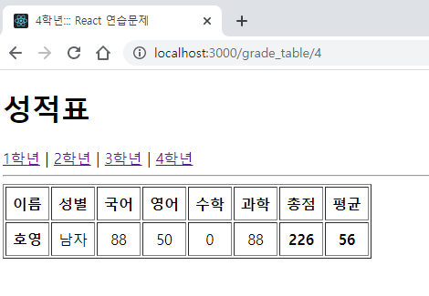

# 권채림 04-props 연습문제

> 2022-10-19

## 문제1

### index.js
```javascript
import React from 'react';
import ReactDOM from 'react-dom/client';
import App from './App';
import { BrowserRouter } from 'react-router-dom'
import Meta from './Meta';


const root = ReactDOM.createRoot(document.getElementById('root'));
root.render(
  <React.StrictMode>
    <Meta />
    <BrowserRouter><App /></BrowserRouter>
  </React.StrictMode>
);


```

### App.js
```javascript
import React from 'react';
import { Link, Routes, Route } from 'react-router-dom';
import GradeTable from './pages/GradeTable';


function App() {
  return (
    <div>
      <h1>성적표</h1>
      <nav>
      <Link to='/grade_table/1'>1학년</Link>&nbsp;|&nbsp;
      <Link to='/grade_table/2'>2학년</Link>&nbsp;|&nbsp;
      <Link to='/grade_table/3'>3학년</Link>&nbsp;|&nbsp;
      <Link to='/grade_table/4'>4학년</Link>
      </nav>

      <hr />
      <Routes>
        <Route path="/grade_table/:id" element={<GradeTable />} />
      </Routes>
    </div>
  );
}

export default App;


```

### Meta.js
```javascript
import React from 'react';
import { Helmet, HelmetProvider } from 'react-helmet-async';


const Meta = (props) => {
    return (
        <HelmetProvider>
            <Helmet>
                <meta charset = 'utf-8' />
                <title>{props.title}</title>
                <meta name='description' content={props.descriptrion} />
    
            </Helmet>
        </HelmetProvider>
    )
}

Meta.defaultProps = {
    title: 'React 연습문제',
    description: 'React.js 예제 입니다',
}

export default Meta;

```

### GradeTable.js
```javascript
import React from 'react';
import Meta from '../Meta';
import { useParams } from 'react-router-dom';
import GradeData from '../GradeData';
import GradeItem from '../components/GradeItem';

const GradeTable = () => {
    console.clear();
    const params = useParams();
    const { id } = params;
    const title = `${id}학년::: React 연습문제`;
    
    
    return (
        <div>
            <Meta title = {title} />

            <table border="1" cellPadding="7">
                <thead>
                    <tr align="center">
                        <th>이름</th>
                        <th>성별</th>
                        <th>국어</th>
                        <th>영어</th>
                        <th>수학</th>
                        <th>과학</th>
                        <th>총점</th>
                        <th>평균</th>  
                    </tr>
                </thead>
                <tbody>
                {GradeData[`${id}학년`].map((v, i) => {
                    return (
                        <GradeItem 
                            key={i}
                            name = {v.이름}
                            gen = {v.성별}
                            kor = {v.국어}
                            eng = {v.영어}
                            math = {v.수학}
                            sinc = {v.과학}
                        />
                    )
                })}
                </tbody>
            </table>

        </div>
    )
}

export default GradeTable;

```

### GradeItem.js
```javascript
import React from 'react';
import PropTypes from 'prop-types';


const GradeItem = ({name, gen, kor, eng, math, sinc}) => {
    const sum = parseInt(kor + eng + math + sinc);
    const avg = parseInt(sum / 4);

    return (
        <tr align="center">
            <td><strong>{name}</strong></td>
            <td>{gen}</td>
            <td>{kor}</td>
            <td>{eng}</td>
            <td>{math}</td>
            <td>{sinc}</td>
            <td><strong>{sum}</strong></td>
            <td><strong>{avg}</strong></td>
        </tr>
    )
}

GradeItem.propTypes = {
    name: PropTypes.string.isRequired,
    level: PropTypes.number.isRequired,
    sex: PropTypes.string.isRequired
}

GradeItem.defaultProps = {
    kor: 0,
    eng: 0,
    math: 0,
    sinc: 0
}

export default GradeItem;

```





