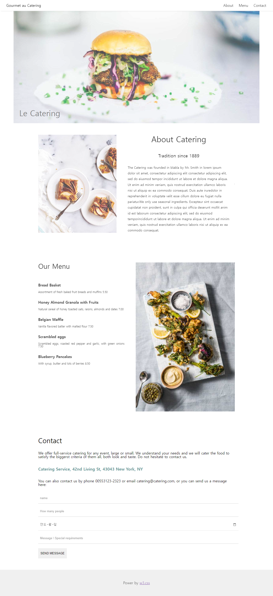
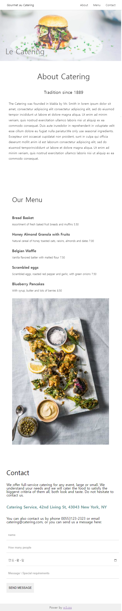

# 권채림 Layout-demo 연습문제

> 2022-10-21

### src

## index.js
 
 ```javascript
import React from 'react';
import ReactDOM from 'react-dom/client';
import App from './App';
import { BrowserRouter } from 'react-router-dom';
import Meta from './Meta';

const root = ReactDOM.createRoot(document.getElementById('root'));
root.render(
  <React.StrictMode>
     <Meta />
     <BrowserRouter><App /></BrowserRouter>
  </React.StrictMode>
);

 ```
## App.js
 
 ```javascript
import React from 'react';
import { Routes, Route } from "react-router-dom";

import Navbar from './common/Navbar';
import Footer from './common/Footer';
import Main from './pages/Main';
import GlobalStyles from './GlobalStyles'

function App() {
  return (
    <div>
      <GlobalStyles />
      <Navbar />
      <Routes>
        <Route path='/' exact={true} element={<Main />}/>
        <Route path='/About' exact={true} element={<Main />}/>
      </Routes>
      <Footer />
    </div>
  );
}

export default App;


 ```

### common

## Navbar.js
 
 ```javascript
import React from 'react';
import styled from 'styled-components';
import { NavLink } from 'react-router-dom';
import mq from '../MediaQuery';

const NavbarContainer = styled.nav`
    display: flex;
    justify-content: space-between;
    align-items: center;
    background-color: white;
    padding: 8px 12px;
    box-shadow: 0 4px 4px -4px #d5d5d5;
    position: fixed;
    z-index: 1;
    width: 100%;
    font-size: 16px;


    .navbarLogo {
        padding: 8px 16px;
    }

    .navbarMenu {
        display: flex;
        margin: 0 30px;
    }

    .navbarMenu a {
        padding: 8px 12px;
        opacity: 0.8;
    }

    a {
        text-decoration: none;
        color: #000;
    }

    .navbarMenu a:hover{
        background-color: #d5d5d5;
    }

    .navbarLogo:hover {
        background-color: #d5d5d5;
    }

    ${mq.maxWidth('md')`
        font-size: 13px;
    `}
`

function Navbar() {
  return (
    <NavbarContainer>
        <div className='navbarLogo'>
            <NavLink to ="/">Gourmet au Catering</NavLink>
        </div>
        <div className='navbarMenu'>
            <NavLink to ="/About" className='right'>About</NavLink>
            <NavLink to ="/Menu"  className='right'>Menu</NavLink>
            <NavLink to ="/Contact" className='right'>Contact</NavLink>
        </div>
    </NavbarContainer>
  );
}

export default Navbar;


 ```
## Footer.js
 
 ```javascript

import React from 'react';
import styled from 'styled-components';
import mq from '../MediaQuery';

const FooterContainer = styled.footer`
    padding: 50px;
    background-color: #e9e9e9;
    display: flex;
    justify-content: center;
    opacity: 0.7;

    a {
      text-decoration: underline;
    }

    ${mq.maxWidth('sm')`
        padding: 10px;
        font-size: 14px;
    `}
`

function Footer() {
  return (
    <FooterContainer>
        <p>Power by  <a href="https://www.w3schools.com/w3css/default.asp">w3.css</a></p>
    </FooterContainer>
  );
}

export default Footer;

 ```

### pages/Main

## index.js
 
 ```javascript
import React from 'react';
import styled from 'styled-components';
import mq from '../../MediaQuery';
import About from './About';
import Contact from './Contact';
import Jumbotron from './Jumbotron';
import Menu from './Menu';


const MainContainer = styled.section`
    font-family: 'Times New Roman, Georgia, Serif';
    max-width: 90%;
    margin: auto;
    background-color: #fff;
    display: flex;
    flex-wrap: nowrap;
    flex-direction: column;

    ${mq.maxWidth('sm')`
        max-width: 100%;
    `}

`

const index = () => {
  return (
    <MainContainer>
        <Jumbotron />
        <About />
        <Menu />
        <Contact />
    </MainContainer>
  );
}

export default index;


 ```
## Jumbotron.js
 
 ```javascript
import React from 'react';
import styled from 'styled-components';
import mq from '../../MediaQuery';


const HeaderImg = styled.header`

    text-align: center;
    position: relative;

    .headerImg {
        width: 100%;
        opacity: 0.7;

        ${mq.maxWidth('md')`
            width: 100%;
            font-size: 10px;
         `}
    }

    .headerTxt {
        /* background-color: aqua; */
        color: #807d7d;
        font-size: 35px;
        position: absolute;
        bottom: 30px;
        left: 25px;
    }

`
const Jumbotron = () => {
  return (
    <HeaderImg>
         
        <div>
            <h1 className="headerTxt">Le Catering</h1>
        </div>
    </HeaderImg>
  );
}

export default Jumbotron;


 ```
## About.js
 
 ```javascript
import React from 'react';
import styled from 'styled-components';
import mq from '../../MediaQuery';


const AboutContainer = styled.header`

    display: flex;
    justify-content: center;
    align-items: center; 
    margin: 0 auto;
    width: 80%;
    
    ${mq.maxWidth('md')`
         width: 100%;
    `}

    .content_img {
        opacity: 0.7;
        padding-right: 30px; 
    }

    .content_img img {
        width: 100%;

        ${mq.maxWidth('sm')`
            display: none;  
        `}
            
    }


    .content_txt {
        width: 90%;
        padding: 50px 20px;
        text-align: center;
        opacity: 0.8;
        margin: 0 auto;
        /* background-color: pink; */
        
        ${mq.maxWidth('sm')`
             width: 100%;
             margin: 0 auto;
             padding: 50px 10px;
         `}
    }


    .content_txt h1 {
        font-size: 35px;
    }

    .content_txt h5 {
        font-size: 20px;
        padding: 30px 0;
    }

    .content_txt p {
        line-height: 40px;
        font-size: 14px;
        text-align: start;
        line-height: 1.8;
    }

    hr {
        color: black;
    }   

`

const About = () => {
  return (
    <AboutContainer>
        <div className="content_img">
            
        </div>
        <div className="content_txt">
            <h1>About Catering</h1>
            <br />
            <h5>Tradition since 1889</h5>
            <p><span>The Catering was founded in blabla by Mr. Smith in lorem ipsum dolor sit amet, consectetur adipiscing elit consectetur adipiscing elit, sed do eiusmod tempor incididunt ut labore et dolore magna aliqua. Ut enim ad minim veniam, quis nostrud exercitation ullamco laboris nisi ut aliquip ex ea commodo consequat. Duis aute iruredolor in reprehenderit in voluptate velit esse cillum dolore eu fugiat nulla pariatur.We only use seasonal ingredients.
            Excepteur sint occaecat cupidatat non proident, sunt in culpa qui officia deserunt mollit anim id est laborum consectetur adipiscing elit, sed do eiusmod temporincididunt ut labore et dolore magna aliqua. Ut enim ad minim veniam, quis nostrud exercitation ullamco laboris nisi ut aliquip ex ea commodo consequat.</span></p>
        </div>

        <hr />
        
    </AboutContainer>
  );
}

export default About;


 ```
## Menu.js
 
 ```javascript
import React from 'react';
import styled from 'styled-components';
import mq from '../../MediaQuery';


const MenuContainer = styled.div`
    
    display: flex;
    padding: 80px 0;
    flex-direction: row;
    width: 80%;
    margin: 0 auto;
    /* background-color: pink; */

    ${mq.maxWidth('lg')`
         flex-direction: column;
    `}

    .content_menu_list {
        width: 50%;
        padding-right: 50px;
        justify-content: center;
        text-align: justify;
        opacity: 0.8;
        /* background-color: #807d7d; */
        
        ${mq.maxWidth('lg')`
            width: 100%;
            padding: 30px 0;
        `}
    }

    .content_menu_list h1 {
        font-size: 30px;
        margin-bottom: 30px;
    }

    .content_menu_list h4 {
        margin: 16px 0;
        font-weight: bold;
    }

    .content_menu_list p {
        font-size: 12px;
        width: 100%;
    }

    .content_menu_img img {
        width: 100%;
    }

    .main_contents hr {
        opacity: 0.3;
    }

`

const Menu = () => {
  return (
    <MenuContainer>
        <div className="content_menu_list">
            <h1>Our Menu</h1>
            <br/>
            <h4>Bread Basket</h4>
            <p>Assortment of fresh baked fruit breads and muffins 5.50</p>
            <br/>
            <h4>Honey Almond Granola with Fruits</h4>
            <p>Natural cereal of honey toasted oats, raisins, almonds and dates 7.00</p>
            <br/>
            <h4>Belgian Waffle</h4>
            <p>Vanilla flavored batter with malted flour 7.50</p>
            <br />
            <h4>Scrambled eggs</h4>
            <p>Scrambled eggs, roasted red pepper and garlic, with green onions 7.50</p>
            <br />
            <h4>Blueberry Pancakes</h4>
            <p>With syrup, butter and lots of berries 8.50</p>
        </div>
        <div className="content_menu_img">
            
        </div>
    </MenuContainer>
  );
}

export default Menu;


 ```
## Contact.js
 
 ```javascript
import React from 'react';
import styled from 'styled-components';
import mq from '../../MediaQuery';

const ContactContainer = styled.div`
    
    padding: 30px;
    /* background-color: blue; */
    width: 80%;
    margin: 0 auto;

    ${mq.maxWidth('md')`
         width: 90%;

    `}
    
    h1 {
        font-size: 30px;
    }

    .contact_t {
        
        padding: 18px 0;
    }

    b {
        font-weight: bold;
        font-size: 18px;
        color:rgb(101, 150, 150)
    }

    .input_form{
        padding: 18px;
        margin-top: 10px;
        border-width: 0 0 1px 0;
        border-color: #d1d1d1;
        /* background-color: yellow;  */
        
    }

    input[type="text"],
    input[type="date"] {
        width: 100%;
        padding: 16px 8px;

    }

    .input_btn {
        padding: 15px 10px;
        margin: 20px 0;
        border-style: none;
        cursor: pointer;
    }

    .input_form::placeholder{
        opacity: 0.8;
    }

    .submit input[type="date"] {
        opacity: 0.6;
    }
`

const Contact = () => {
  return (
    <ContactContainer>
        <h1>Contact</h1>
            <br />
            <p className="contact_t">We offer full-service catering for any event, large or small. We understand your needs and we will cater the food to satisfy the biggerst criteria of them all, both look and taste. Do not hesitate to contact us.</p>
            <p className="contact_t"><b>Catering Service, 42nd Living St, 43043 New York, NY</b></p>
            <p className="contact_t">You can also contact us by phone 00553123-2323 or email catering@catering.com, or you can send us a message here:</p>
            <form className="submit">
                <p><input className="input_form" type="text" placeholder="name" /></p>
                <p><input className="input_form" type="text" placeholder="How many people" /></p>
                <p><input className="input_form" type="date" /></p>
                <p><input className="input_form" type="text" placeholder="Message \ Special requirements" /></p>
                <p><input className="input_btn" type="submit" value="SEND MESSAGE" /></p>
            </form>
    </ContactContainer>
  );
}

export default Contact;


 ```







