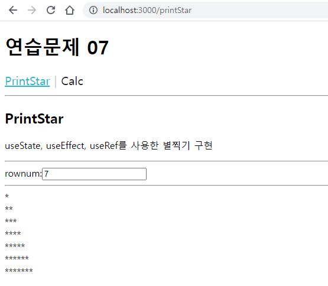
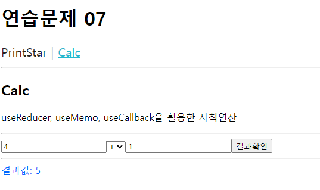
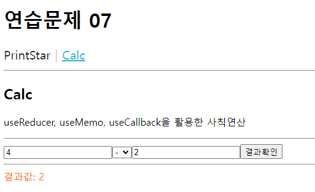
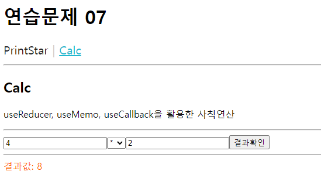

# 권채림 hook 연습문제

> 2022-10-25

### App.js
 
 ```javascript
import { Routes, Route } from "react-router-dom";
import MenuLink from "./components/MenuLink";
import Calc from "./pages/Calc";
import PrintStar from "./pages/PrintStar";

function App() {
  return (
    <div>
      <h1>연습문제 07</h1>
      <nav>
        <MenuLink to='/printStar'>PrintStar</MenuLink>
        <MenuLink to='/Calc'>Calc</MenuLink>
      </nav>
      <hr />
      <Routes>
        <Route path='/printStar' element = {<PrintStar/>}/>
        <Route path='/calc' element = {<Calc/>}/>
      </Routes>
    </div>
    
  );
}

export default App;

 ```

### pages/PrintStar.js
 
 ```javascript
import React from 'react';

const PrintStar = () => {
    const [rowNum, setRowNum] = React.useState('');
    const consoleBox = React.useRef();

    const setStar = () => {
        let str = "";
        for(let i=0; i<rowNum; i++) {
            for(let j=0; j<i+1; j++) {
                str += "*";
            }
            str+= '<br/>'
        }
        consoleBox.current.innerHTML = str ;   
    }

    React.useEffect(() => {
        console.clear();
        setStar();
    })

    return (
        <div>
            <h2>PrintStar</h2>
            <p>useState, useEffect, useRef를 사용한 별찍기 구현</p>
            <hr/>
            <label htmlFor="star">rownum:</label>
            <input type="text" id='star' value={rowNum} onChange={e=> setRowNum(e.currentTarget.value)}/>
            <hr/>
            <div ref={consoleBox}></div>
        </div>
    )
}

export default PrintStar;
 ```
### pages/Calc.js
 
 ```javascript
import React from 'react';

//getResultValue 함수가 호출됨에 따라 간접적으로 호출될 함수
function calc(state, action) {
    console.log(action);

    switch(action[2]) {
        case 'plus':
            return action[0]+action[1];
        case 'minus':
            return action[0]-action[1];
        case 'multi':
            return action[0]*action[1];
        case 'divi':
            return action[0]/action[1];
        default: 
            return 0;
    }
}

const Calc = () => {
    //참조변수 정의
    const x = React.useRef();
    const y = React.useRef();
    const exec = React.useRef();
    
    //상태값과 갱신함수 getResultValue 정의
    const [resultValue, getResultValue] = React.useReducer(calc,0)

    //버튼 이벤트 
    const onBtnClick = React.useCallback((e) => {
        const action = [Number(x.current.value), Number(y.current.value), exec.current.value];
        // getResultValue 에 action값을 전달
        getResultValue(action);
    }, [])

    //색깔 변경
    const color = React.useMemo(() => {
       return resultValue % 2 === 0 ? '#f60': '#06f';
    }, [resultValue])

    return (
        <div>
            <h2>Calc</h2>
            <p>useReducer, useMemo, useCallback을 활용한 사칙연산</p>
            <hr />
            <input type="text" ref={x}/>
            <select name="calc" id="calc" ref={exec}>
                <option value="plus">+</option>
                <option value="minus">-</option>
                <option value="multi">*</option>
                <option value="divi">/</option>
            </select>
            <input type="text" ref={y}/>
            {/* 버튼 클릭하면 함수실행 */}
            <button type="button" onClick={onBtnClick}>결과확인</button>
            <hr />
            <div style={{color: color}}>결과값: {resultValue}</div>
        </div>
    )
}

export default Calc;
 ```







