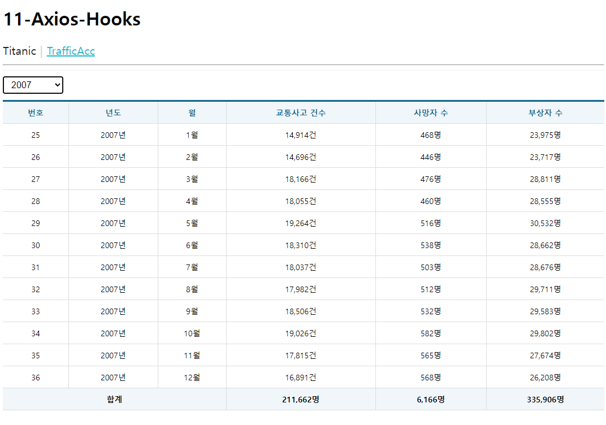

# 권채림 AxiosHook 연습문제

> 2022-11-04

## 문제1
### App.js
```javascript
import React from "react";
import { NavLink, Routes, Route } from "react-router-dom";
import Titanic from './pages/Titanic';
import MenuLink from './components/MenuLink';
import TrafficAcc from "./pages/TrafficAcc";


function App() {
  return (
    <div>
      <h1>11-Axios-Hooks</h1>
      <nav>
        <MenuLink to='/titanic'>Titanic</MenuLink>
        <MenuLink to='/traffic'>TrafficAcc</MenuLink>
      </nav>
      <hr/>
      <Routes>
        <Route path='/titanic' element={<Titanic/>}/>
        <Route path='/traffic' element={<TrafficAcc/>}/>
      </Routes>
    </div>
  );
}

export default App;

```
### TrafficAcc.js
 
 ```javascript
import React from 'react';
import styled from 'styled-components';
import Spinner from '../components/Spinner';
import Table from "../components/Table";

import useAxios from 'axios-hooks';
import useMountedRef from "../hooks/useMountedRef";

const SelectContainer = styled.div`
  position: sticky;
  top: 0;
  background-color: #fff;
  border-top: 1px solid #eee;
  border-bottom: 1px solid #eee;
  padding: 10px 0;
  margin: 0;

  select {
    margin-right: 15px;
    font-size: 16px;
    padding: 5px 10px;
  }
`

const TrafficAcc = () => {
    const [{ data, loading, error}, refetch] = useAxios('/traffic_acc')

    const [year, setYear] = React.useState('')

    const mountedRef = useMountedRef();


    const  yearArr =[];
    for( let i=2005; i< 2016; i++ ) {
        yearArr.push(i);
    }

    //합계 구하기
    let accSum = 0;
    let deathSum = 0;
    let injurySum = 0;
    data && data.map(({accident, death, injury},i)=>{
        accSum+=accident;
        deathSum+=death;
        injurySum+=injury;  
    })
    console.log(accSum, deathSum, injurySum)

    const onSelectChange = React.useCallback((e) => {
        e.preventDefault();

        const current= e.target;
        const key = current.name;
        const value = current[current.selectedIndex].value;

        const newYear = {...year, [key]: value}
        setYear(newYear);
        console.log(newYear);

    },[year])

    React.useEffect(()=> {
        if(mountedRef.current) {
            const params = {};
            for (const key in year){
                if(year[key]) {
                    params[key] = year[key];
                }
            }

            refetch({
                params: params,
            })
        }
    },[mountedRef, refetch, year])


    if(error) {
        console.error(error);
        return (
          <div>
            <h1>Oops~~!!! {error.code}</h1>
            <hr/>
            <p>{error.message}</p>
          </div>
        )
      }


    return (
        <div>
            <Spinner loading={loading}/>

            <SelectContainer>
                <select name='year' onChange={onSelectChange}>
                    <option value="">-- 년도 --</option>
                    {yearArr.map((v, i) => {
                        return (
                            <option key={i} value={v}>{v}</option>
                        )
                    })}
                </select>
            </SelectContainer>

            <Table>
                <thead>
                    <tr>
                        <th>번호</th>
                        <th>년도</th>
                        <th>월</th>
                        <th>교통사고 건수</th>
                        <th>사망자 수</th>
                        <th>부상자 수</th>
                    </tr>
                </thead>
                <tbody>
                    {data && data.map(({id, year, month, accident, death, injury},i)=>{
                        
                        return (
                            <tr key={id}>
                                <td>{id}</td>
                                <td>{year}년</td>
                                <td>{month}월</td>
                                <td>{accident.toLocaleString()}건</td>
                                <td>{death.toLocaleString()}명</td>
                                <td>{injury.toLocaleString()}명</td>
                            </tr>
                        )
                    })}

                </tbody>
                <tfoot>
                    <tr>
                        <td colSpan='3'>합계</td>
                        <td>{accSum.toLocaleString()}명</td>
                        <td>{deathSum.toLocaleString()}명</td>
                        <td>{injurySum.toLocaleString()}명</td>
                    </tr>
                </tfoot>
            </Table>
        </div>
    )
}

export default TrafficAcc;


 ```
 


