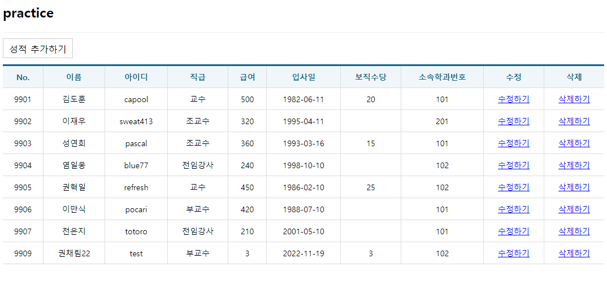
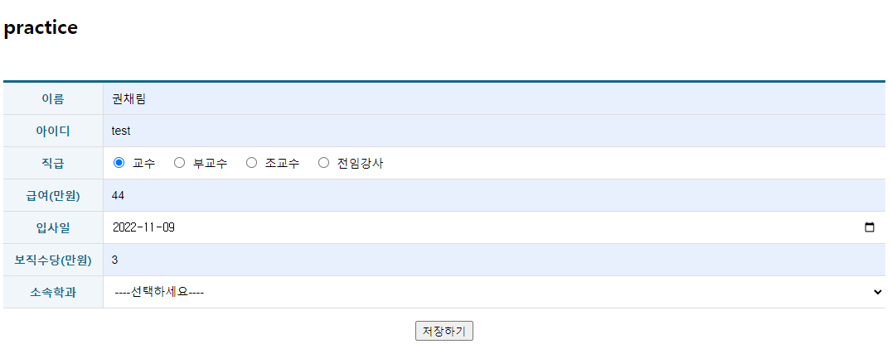
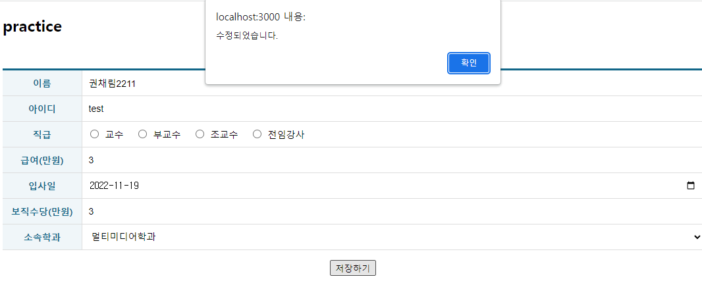

# 권채림 axios-hook-crud 연습문제

> 2022-11-08

## 문제1

### ProfList.js
 
 ```javascript
import React, {useEffect, useState} from 'react';
import useAxios from 'axios-hooks';
import styled from 'styled-components';
import { NavLink } from 'react-router-dom';
import Spinner from '../components/Spinner';
import Table from '../components/Table';

const LinkContainer = styled.div`
    position: sticky;
    top:0;
    background-color: #fff;
    border-top: 1px solid #eee;
    border-bottom: 1px solid #eee;
    padding: 10px 0;
`

const TopLink = styled(NavLink)`
    margin-right: 15px;
    display: inline-block;
    font-size: 16px;
    padding: 7px 10px 5px 10px;
    border: 1px solid #ccc;
    background-color: #fff;
    color: #000;
    text-decoration: none;

    &:hover {
        background-color: #06f2;
    }
`

const ProfList = () => {
    const [professor, setProfessor] = useState([]);
    const [{data, loading: loading1, error}, refetch] = useAxios("/professor", {
        useCache: false
    });
    const [{loading: loading2}, sendDelete] = useAxios({
        method: 'DELETE'
    }, {
        useCache: false,
        manual: true
    })

    useEffect(() => {
        setProfessor(data)
    }, [data]);

    const onDeleteClick = (e) => {
        e.preventDefault();

        const current = e.target;

        const id = parseInt(current.dataset.id);
        const name = current.dataset.name;

        if(window.confirm(`정말 ${name}교수의 정보를 삭제하시겠습니까?`)){
            (async ()=> {
                try {
                    await sendDelete({url: `/professor/${id}`});
                } catch(e) {
                    console.error(e);
                    window.alert(`[${e.response.status}] ${e.response.statusText}\n${e.message}`);
                }

                setProfessor(currentData => {
                    const findIndex = currentData.findIndex((v, i) => v.id === id);
                    currentData.splice(findIndex, 1);
                    return currentData;
                })
            })();
        }
    }

    return (
        <div>
            <Spinner loading={loading1 || loading2}/>
            <LinkContainer>
                <TopLink to="add">성적 추가하기</TopLink>
            </LinkContainer>
            {error ? (
                <div>
                <h1>Oops~!!! {error.code} Error.</h1>
                <hr/>
                <p>{error.message}</p>
            </div>
            ) : (
                <Table>
                    <thead>
                        <tr>
                            <th>No.</th>
                            <th>이름</th>
                            <th>아이디</th>
                            <th>직급</th>
                            <th>급여</th>
                            <th>입사일</th>
                            <th>보직수당</th>
                            <th>소속학과번호</th>
                            <th>수정</th>
                            <th>삭제</th>
                        </tr>
                    </thead>
                    <tbody>
                        {data && data.map(({id, name, userid, position, sal, hiredate, comm, deptno}, i)=>{
                            return(
                                <tr key={id}>
                                    <td>{id}</td>
                                    <td>{name}</td>
                                    <td>{userid}</td>
                                    <td>{position}</td>
                                    <td>{sal}</td>
                                    <td>{hiredate.substring(0,10)}</td>
                                    <td>{comm}</td>
                                    <td>{deptno}</td>
                                    <td>
                                        <NavLink to={`edit/${id}`}>수정하기</NavLink>
                                    </td>
                                    <td>
                                        <a href="#!" data-id={id} data-name={name} onClick={onDeleteClick}>삭제하기</a>
                                    </td>
                                </tr>
                            )
                        })}
                    </tbody>
                </Table>
            )}
        </div>
    )
}

export default React.memo(ProfList);


 ```
### ProfAdd.js
 
 ```javascript
import React, {memo} from 'react';
import useAxios from 'axios-hooks';
import styled from 'styled-components';
import Table from '../components/Table';
import { useNavigate } from 'react-router-dom'
import Spinner from '../components/Spinner';

const TableEx = styled(Table)`
    margin-top: 50px;
    margin-bottom: 15px;

    .inputWrapper {
        padding: 0;
        position: relative;
        text-align: left;

        .field {
            box-sizing: border-box;
            display: block;
            position: absolute;
            left: 0;
            top: 0;
            width: 100%;
            height: 100%;
            border: 0;
            padding: 0 10px;
            outline: none;
            font-size: 14px;
        }

        label {
            margin-left: 7px;
            margin-right: 10px;

            input {
                margin-right: 10px;
            }
        }
    }
`;

const ProfAdd = memo(() => {

    const navigate = useNavigate();

    const [{data, error}, getDept] = useAxios("/department")

    const [{loading}, refetch] = useAxios({
        url: "/professor",
        method: "POST",
    }, {manual: true});

    const onSubmit = React.useCallback((e) => {
        e.preventDefault();

        const current = e.target;

        const name = current.name.value;
        const userid = current.userid.value;
        const position = current.position.value;
        const sal = current.sal.value;
        const hiredate = current.hiredate.value;
        const comm = current.comm.value;
        const deptno = current.deptno.value;
        
        let json = null;

        (async ()=>{
            try {
                const response = await refetch({
                    data: {
                        name: name,
                        userid: userid,
                        position: position,
                        sal: parseInt(sal),
                        hiredate: hiredate,
                        comm: parseInt(comm),
                        deptno: deptno
                    }   
                })
                json = response.data;
            } catch(e) {
                console.error(e);
                window.alert(`[${e.response.status}] ${e.response.statusText}\n${e.message}`);
            }

            if( json !== null) {
                window.alert("저장되었습니다.");
                navigate('/');
            }
        })();
    },[])
    
    return (
       <>
       <Spinner loading={loading}/>
       <form onSubmit={onSubmit}>
        <TableEx>
            <colgroup>
                <col width="120"></col>
            </colgroup>
            <tbody>
                <tr>
                    <th>이름</th>
                    <td className='inputWrapper'><input className='field' type="text" name="name" /></td>
                </tr>
                <tr>
                    <th>아이디</th>
                    <td className='inputWrapper'><input className='field' type="text" name="userid" /></td>
                </tr>
                <tr>
                    <th>직급</th>
                    <td className='inputWrapper'>
                        <label><input type="radio" name="position" value="교수"/>교수</label>
                        <label><input type="radio" name="position" value="부교수"/>부교수</label>
                        <label><input type="radio" name="position" value="조교수"/>조교수</label>
                        <label><input type="radio" name="position" value="전임강사"/>전임강사</label>
                    </td>
                </tr>
                <tr>
                    <th>급여(만원)</th>
                    <td className='inputWrapper'>
                        <input className='field' type="number" name="sal" placeholder='숫자만 입력'/>
                    </td>
                </tr>
                <tr>
                    <th>입사일</th>
                    <td className='inputWrapper'>
                        <input className='field' type="date" name="hiredate" />
                    </td>
                </tr>
                <tr>
                    <th>보직수당(만원)</th>
                    <td className='inputWrapper'>
                        <input className='field' type="number" name="comm" placeholder='숫자만 입력'/>
                    </td>
                </tr>
                <tr>
                    <th>소속학과</th>
                    <td className='inputWrapper'>
                        <select name="deptno" className="field">
                            <option value="">----선택하세요----</option>
                            {data && data.map(({id, dname}, i)=>{
                                return(
                                    <option key={id} value={id}>{dname}</option>
                                )
                            })}

                        </select>
                    </td>
                </tr>
            </tbody>
        </TableEx>
        <div style={{textAlign:'center'}}>
            <button type='submit'>저장하기</button>
        </div>
       </form>
       </>
    )
})

export default ProfAdd;


 ```
### ProfEdit.js
 
 ```javascript
import React, {memo} from 'react';
import useAxios from 'axios-hooks';
import styled from 'styled-components';
import Table from '../components/Table';
import { useNavigate, useParams } from 'react-router-dom'
import Spinner from '../components/Spinner';

const TableEx = styled(Table)`
    margin-top: 50px;
    margin-bottom: 15px;

    .inputWrapper {
        padding: 0;
        position: relative;
        text-align: left;

        .field {
            box-sizing: border-box;
            display: block;
            position: absolute;
            left: 0;
            top: 0;
            width: 100%;
            height: 100%;
            border: 0;
            padding: 0 10px;
            outline: none;
            font-size: 14px;
        }

        label {
            margin-left: 7px;
            margin-right: 10px;

            input {
                margin-right: 10px;
            }
        }
    }
`;

const ProfEdit = memo(() => {

    const {id} = useParams();

    const navigate = useNavigate();

    const [{data, loading, error}, getDept] = useAxios("/department")

    const [{data: data2, loading:loading2, error: error2}, refetch] = useAxios(`/professor/${id}`, {
        useCache: false
    });

    const onSubmit = React.useCallback((e) => {
        e.preventDefault();

        const current = e.target;

        const name = current.name.value;
        const userid = current.userid.value;
        const position = current.position.value;
        const sal = current.sal.value;
        const hiredate = current.hiredate.value;
        const comm = current.comm.value;
        const deptno = current.deptno.value;
        
        let json = null;

        (async ()=>{
            try {
                const response = await refetch({
                    method: 'PUT',
                    data: {
                        name: name,
                        userid: userid,
                        position: position,
                        sal: parseInt(sal),
                        hiredate: hiredate,
                        comm: parseInt(comm),
                        deptno: deptno
                    }   
                })
                json = response.data;
            } catch(e) {
                console.error(e);
                window.alert(`[${e.response.status}] ${e.response.statusText}\n${e.message}`);
            }

            if( json !== null) {
                window.alert("수정되었습니다.");
                navigate('/');
            }
        })();
    },[refetch, navigate])
    
    return (
       <>
       <Spinner loading={loading || loading2}/>
       {error2 || error ? (
            <div>
            <h1>Oops~!!! {error.code} Error.</h1>
            </div>
           
       ): (data2 && (
            <form onSubmit={onSubmit}>
                    <TableEx>
                        <colgroup>
                            <col width="120"></col>
                        </colgroup>
                        <tbody>
                            <tr>
                                <th>이름</th>
                                <td className='inputWrapper'><input className='field' type="text" name="name" defaultValue={data2.name} /></td>
                            </tr>
                            <tr>
                                <th>아이디</th>
                                <td className='inputWrapper'><input className='field' type="text" name="userid" defaultValue={data2.userid} /></td>
                            </tr>
                            <tr>
                                <th>직급</th>
                                <td className='inputWrapper'>
                                    <label><input type="radio" name="position" value="교수" defaultChecked={data2.position === '교수'}/>교수</label>
                                    <label><input type="radio" name="position" value="부교수" defaultChecked={data2.position === '부교수'}/>부교수</label>
                                    <label><input type="radio" name="position" value="조교수" defaultChecked={data2.position === '조교수'}/>조교수</label>
                                    <label><input type="radio" name="position" value="전임강사" defaultChecked={data2.position === '전임강사'}/>전임강사</label>
                                </td>
                            </tr>
                            <tr>
                                <th>급여(만원)</th>
                                <td className='inputWrapper'>
                                    <input className='field' type="number" name="sal" placeholder='숫자만 입력' defaultValue={data2.sal}/>
                                </td>
                            </tr>
                            <tr>
                                <th>입사일</th>
                                <td className='inputWrapper'>
                                    <input className='field' type="date" name="hiredate" defaultValue={data2.hiredate}/>
                                </td>
                            </tr>
                            <tr>
                                <th>보직수당(만원)</th>
                                <td className='inputWrapper'>
                                    <input className='field' type="number" name="comm" placeholder='숫자만 입력' defaultValue={data2.comm}/>
                                </td>
                            </tr>
                            <tr>
                                <th>소속학과</th>
                                <td className='inputWrapper'>
                                    <select name="deptno" className="field" defaultValue={data2.deptno}>
                                        <option value="">----선택하세요----</option>
                                        {data && data.map(({id, dname}, i)=>{
                                            return(
                                                <option key={id} value={id}>{dname}</option>
                                            )
                                        })}

                                    </select>
                                </td>
                            </tr>
                        </tbody>
                    </TableEx>
                    <div style={{textAlign:'center'}}>
                        <button type='submit'>저장하기</button>
                    </div>
            </form>
       )
       )}
       
       </>
    )
})

export default ProfEdit;


 ```







