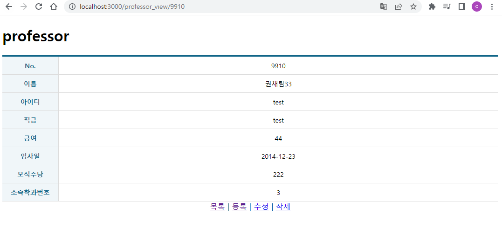
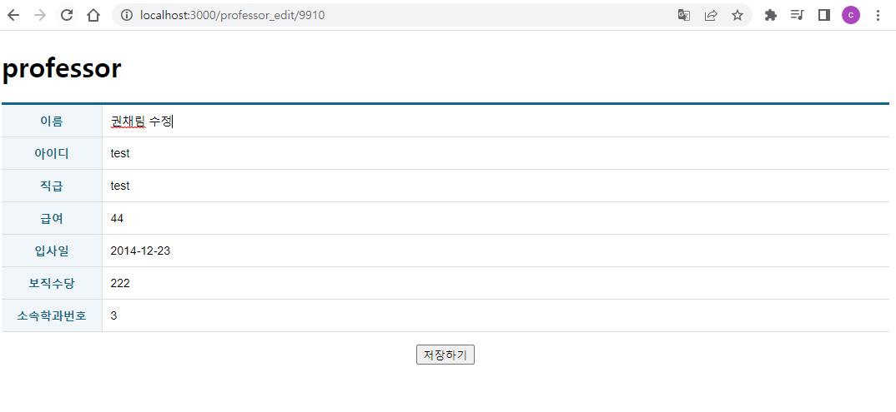

# 권채림 react crud 연습문제

> 2022-11-16

## 문제1 Professor 

### App.js
 
 ```javascript
import React, {memo} from 'react';
import {Routes, Route } from "react-router-dom";
import ProfessorList from './pages/ProfessorList';
import ProfessorAdd from './pages/ProfessorAdd';
import ProfessorView from './pages/ProfessorView';
import ProfessorEdit from './pages/ProfessorEdit';

const App = memo(() => {
  return (
    <div>
      <h1>professor</h1>
      
      <Routes>
        <Route path='/' exapt={true} element={<ProfessorList/>}/>
        <Route path='/professor_add' element={<ProfessorAdd/>}/>
        <Route path='/professor_view/:id' element={<ProfessorView/>}/>
        <Route path='/professor_edit/:id' element={<ProfessorEdit/>}/>
      </Routes>
    </div>
  );
})

export default App;

 ```
### index.js
 
 ```javascript
import React from 'react';
import ReactDOM from 'react-dom/client';
// /*
 import App from './App';
/*/
import App from './test';
/**/
import { BrowserRouter } from 'react-router-dom';
import { Provider } from 'react-redux';
import store from './store';

const root = ReactDOM.createRoot(document.getElementById('root'));
root.render(
  <Provider store={store}>
    <BrowserRouter>
      <App />
    </BrowserRouter>
  </Provider>
);
 ```
### store.js
 
 ```javascript
import { configureStore } from "@reduxjs/toolkit";
import ProfessorSlice from "./slices/ProfessorSlice";
const store = configureStore({
    reducer: {
        ProfessorSlice: ProfessorSlice,
    }
});

export default store;
 ```
### ProfessorSlice.js
 
 ```javascript
import { createSlice, createAsyncThunk } from '@reduxjs/toolkit'
import axios from 'axios';
import { pending, fulfilled, rejected } from '../helper/ReduxHelper';
import { cloneDeep } from 'lodash';


/** 다중행 데이터 조회를 위한 비동기 함수 */
export const getList = createAsyncThunk("ProfessorSlice/getList", async (payload, {rejectWithValue }) => {

    let result = null;
    const URL = process.env.REACT_APP_API_PROFESSOR_LIST;

    try {
        const response = await axios.get(URL);
        result = response.data;
    } catch (err) {
        result = rejectWithValue(err.response);
    }
    return result;
});

/** 단일행 데이터 조회를 위한 비동기 함수 */
export const getItem = createAsyncThunk("ProfessorSlice/getItem", async (payload, {rejectWithValue }) => {

    let result = null;
    const URL = process.env.REACT_APP_API_PROFESSOR_ITEM.replace(':id', payload.id);
    console.log(URL);
    try {
        const response = await axios.get(URL);
        result = response.data;
    } catch (err) {
        result = rejectWithValue(err.response);
    }
    return result;
});

/** 데이터 저장을 위한 비동기 함수 */
export const postItem = createAsyncThunk("ProfessorSlice/postItem", async (payload, {rejectWithValue }) => {

    let result = null;
    const URL = process.env.REACT_APP_API_PROFESSOR_LIST;

    try {
        const response = await axios.post(URL, {
            name: payload.name,
            userid: payload.userid,
            position: payload.position,
            sal: payload.sal,
            hiredate: payload.hiredate,
            comm: payload.comm,
            deptno: payload.deptno,
        });
        result = response.data;
    } catch (err) {
        result = rejectWithValue(err.response);
    }
    return result;
});

/** 데이터 수정을 위한 비동기 함수 */
export const putItem = createAsyncThunk("ProfessorSlice/putItem", async (payload, {rejectWithValue }) => {

    let result = null;
    const URL = process.env.REACT_APP_API_PROFESSOR_ITEM.replace(':id', payload.id);

    try {
        const response = await axios.put(URL, {
            name: payload.name,
            userid: payload.userid,
            position: payload.position,
            sal: payload.sal,
            hiredate: payload.hiredate,
            comm: payload.comm,
            deptno: payload.deptno,
        });
        result = response.data;
    } catch (err) {
        result = rejectWithValue(err.response);
    }
    return result;
});

/** 데이터 삭제을 위한 비동기 함수 */
export const deleteItem = createAsyncThunk("ProfessorSlice/deleteItem", async (payload, {rejectWithValue }) => {

    let result = null;
    const URL = process.env.REACT_APP_API_PROFESSOR_ITEM.replace(':id', payload.id);

    try {
        const response = await axios.delete(URL);
        result = response.data;
    } catch (err) {
        result = rejectWithValue(err.response);
    }
    return result;
});


const ProfessorSlice = createSlice({
    name: 'ProfessorSlice',

    initialState: {
        data: null,
        loading: false,
        error: null
    },
    reducers: {
        getCurrentData: (state, action) => {
            return state;
        }
    },
    extraReducers: {
        [getList.pending]: pending,
        [getList.fulfilled]: fulfilled,
        [getList.rejected]: rejected,
        
        [getItem.pending]: pending,
        [getItem.fulfilled]: (state, {meta, payload}) => {
            return {
                data: [payload],
                loading: false,
                error: null
            }
        },
        [getItem.rejected]: rejected,
        
        [postItem.pending]: pending,
        [postItem.fulfilled]: (state, {meta, payload}) => {
            const data = cloneDeep(state.data);
            console.log("data", data);

            data.push(payload);

            return {
                data:data,
                loading: false,
                error: null
            }
        },
        [postItem.rejected]: rejected,

        [deleteItem.pending]: pending,
        [deleteItem.fulfilled]: (state, {meta, payload}) => {
            console.log("meta",meta)
            const data = cloneDeep(state.data);
            const targetId = data.findIndex((v, i) => v.id === Number(meta.arg.id));
            console.log("targetId", targetId);

            data.splice(targetId, 1);

            return {
                data: data,
                loading: false,
                error: null
            }
        },
        [deleteItem.rejected]: rejected,

        [putItem.pending]: pending,
        [putItem.fulfilled]: (state, {meta, payload}) => {
            const data = cloneDeep(state.data);
            const targetId = data.findIndex((v, i) => v.id === Number(meta.arg.id));
            console.log("targetId", targetId);

            data.splice(targetId, 1, payload);

            return {
                data: data,
                loading: false,
                error: null
            }
        },
        [putItem.rejected]: rejected,
    },
});

export const {getCurrentData} = ProfessorSlice.actions;
export default ProfessorSlice.reducer;

 ```
### ProfessorList.js
 
 ```javascript
import React, {memo, useCallback} from 'react';
import { useDispatch, useSelector } from 'react-redux';
import { NavLink, useNavigate } from 'react-router-dom';
import Spinner from '../components/Spinner';
import ErrorView from '../components/ErrorView';
import Table from '../components/Table';
import { deleteItem, getList } from '../slices/ProfessorSlice';
import styled from 'styled-components';
import dayjs from 'dayjs';


const ControlContainer = styled.form`
    position: sticky;
    top:0;
    background-color: #fff;
    border-top: 1px solid #eee;
    border-bottom: 1px solid #eee;
    padding: 10px 0;

    .controll {
        margin-right: 5px;
        display: inline-block;
        font-size: 16px;
        padding: 7px 10px 5px 10px;
        border: 1px solid #ccc;
    }

    .clickable {
        background-color: #fff;
        color: #000;
        text-decoration: none;
        cursor: pointer;

        &:hover {
            background-color: #06fe06;
        }
        &:active {
            transform: scale(0.9, 0.9);
        }
    }
`

const ProfessorList = memo(() => {
    const dispatch = useDispatch();
    const {data, loading, error} = useSelector((state) => state.ProfessorSlice);

    React.useEffect(()=>{
        dispatch(getList())
    },[]);

    const navigate = useNavigate();

    const onProfessorItemDelete = useCallback((e) => {
        e.preventDefault();

        const current = e.currentTarget;
        const { id, name} = current.dataset;

        if(window.confirm(`정말 ${name}(을)를 삭제하시겠습니까?`)) {
            dispatch(deleteItem({
                id: id
            }))
        }
    }, []);

    const onProfessorEditClick = useCallback((e) => {
        e.preventDefault();

        const current = e.currentTarget;
        const {id} = current.dataset;

        navigate(`/professor_edit/${id}`);
    })


    return(
        <div>
            {/* 로딩바 */}
            <Spinner loading={loading}/>
            {/* 추가탭 */}
            <ControlContainer>
                <NavLink to="professor_add" className="controll clickable">학과정보 추가하기</NavLink>
            </ControlContainer>
            
            {/* 조회결과 */}
            {error ? (
                <ErrorView error={error}/>
            ) : (
                data && (
                    <Table>
                        <thead>
                            <tr>
                                <th>No.</th>
                                <th>이름</th>
                                <th>아이디</th>
                                <th>직급</th>
                                <th>급여</th>
                                <th>입사일</th>
                                <th>보직수당</th>
                                <th>소속학과번호</th>
                                <th>수정</th>
                                <th>삭제</th>
                            </tr>
                        </thead>
                        <tbody>
                            {
                                data.length > 0 ? (
                                    data.map((v, i) => {
                                        return (
                                            <tr key={v.id}>
                                                <td>{v.id}</td>
                                                <td>
                                                    <NavLink to={`/professor_view/${v.id}`}>{v.name}</NavLink>
                                                </td>
                                                <td>{v.userid}</td>
                                                <td>{v.position}</td>
                                                <td>{v.sal}</td>
                                                <td>{dayjs(v.hiredate).format('YYYY-MM-DD')}</td>
                                                <td>{v.comm}</td>
                                                <td>{v.deptno}</td>
                                                <td>
                                                    <button type='button' data-id = {v.id} data-name={v.name} onClick={onProfessorEditClick} >
                                                        수정하기
                                                    </button>
                                                </td>
                                                <td>
                                                    <button type='button' data-id = {v.id} data-name={v.name} onClick={onProfessorItemDelete}>
                                                        삭제하기
                                                    </button>
                                                </td>
                                            </tr>
                                        )
                                    })
                                ):(
                                    <tr>
                                        <td colSpan='9' align='center'>검색결과가 없습니다.</td>
                                    </tr>
                                )
                            }
                        </tbody>
                    </Table>
                )
            )}
        </div>
    )
})

export default ProfessorList;

 ```
### ProfessorAdd.js
 
 ```javascript
import React, {memo, useCallback} from 'react';
import TableEx from '../components/TableEx';
import { useNavigate } from 'react-router-dom';
import { useSelector, useDispatch } from 'react-redux';
import { postItem } from '../slices/ProfessorSlice';
import Spinner from '../components/Spinner';
import ErrorView from '../components/ErrorView';


const ProfessorAdd = memo(() => {
    const navigate = useNavigate();

    const dispatch = useDispatch();
    const { loading, error} = useSelector((state) => state.ProfessorSlice);

    const onProfessorSubmit = useCallback((e)=>{
        e.preventDefault();

        const current = e.currentTarget;

        dispatch(postItem({
            name: current.name.value,
            userid: current.userid.value,
            position: current.position.value,
            sal: current.sal.value,
            hiredate: current.hiredate.value,
            comm: current.comm.value,
            deptno: current.deptno.value,
        })).then((result) => {
            console.log("result:",result);
            navigate(`/professor_view/${result.payload.id}`);
        })
    }, [])

    return(
        <div>
            <Spinner loading={loading}/>
            {error ? (
                <ErrorView error={error}/>
            ) : (
            <form onSubmit={onProfessorSubmit}>
                <TableEx>
                    <colgroup>
                        <col width="120"/>
                        <col/>
                    </colgroup>
                    <tbody>
                        <tr>
                            <th>이름</th>
                            <td className='inputWrapper'>
                                <input className="field" type="text" name="name"/>
                            </td>
                        </tr>
                        <tr>
                            <th>아이디</th>
                                <td className='inputWrapper'>
                                <input className="field" type="text" name="userid"/>
                            </td> 
                        </tr>
                        <tr>
                            <th>직급</th>
                                <td className='inputWrapper'>
                                <input className="field" type="text" name="position"/>
                            </td> 
                        </tr>
                        <tr>
                            <th>급여</th>
                                <td className='inputWrapper'>
                                <input className="field" type="text" name="sal"/>
                            </td> 
                        </tr>
                        <tr>
                            <th>입사일</th>
                                <td className='inputWrapper'>
                                <input className="field" type="text" name="hiredate"/>
                            </td> 
                        </tr>
                        <tr>
                            <th>보직수당</th>
                                <td className='inputWrapper'>
                                <input className="field" type="text" name="comm"/>
                            </td> 
                        </tr>
                        <tr>
                            <th>소속학과번호</th>
                                <td className='inputWrapper'>
                                <input className="field" type="text" name="deptno"/>
                            </td> 
                        </tr>
                    </tbody>
                </TableEx>

                <div style={{textAlign: 'center'}}>
                    <button type='submit'>저장하기</button>
                </div>
            </form>

            )}
        </div>
    )
})

export default ProfessorAdd;

 ```
### ProfessorEdit.js
 
 ```javascript
import React, {memo, useCallback, useEffect, useMemo} from 'react';
import TableEx from '../components/TableEx';
import { useNavigate, useParams } from 'react-router-dom';
import { useSelector, useDispatch } from 'react-redux';
import { getCurrentData, getItem, putItem } from '../slices/ProfessorSlice';
import Spinner from '../components/Spinner';
import ErrorView from '../components/ErrorView';
import dayjs from 'dayjs';

const ProfessorEdit = memo(() => {
    const { id } = useParams();

    const dispatch = useDispatch();
    const { data, loading, error} = useSelector((state) => state.ProfessorSlice);

    useEffect(()=> {
        dispatch(getCurrentData());
    },[]);

    const item = useMemo(() => {
        if(data) {
            return data.find((v, i) => v.id == id);
        } else {
            dispatch(getItem({id:id}));
        }
    }, [data])

    const navigate = useNavigate();

    const onProfessorSubmit = useCallback((e)=>{
        e.preventDefault();

        const current = e.currentTarget;

        dispatch(putItem({
            id: current.id.value,
            name: current.name.value,
            userid: current.userid.value,
            position: current.position.value,
            sal: current.sal.value,
            hiredate: current.hiredate.value,
            comm: current.comm.value,
            deptno: current.deptno.value,
        })).then((result) => {
            console.log("result:",result);
            navigate(`/professor_view/${result.payload.id}`);
        })
    },[])

    return(
        <div>
            <Spinner loading={loading}/>
            {error ? (
                <ErrorView error={error}/>
            ) : (
            <form onSubmit={onProfessorSubmit}>
                <input type="hidden" name="id" defaultValue={item?.id} />
                <TableEx>
                    <colgroup>
                        <col width="120"/>
                        <col/>
                    </colgroup>
                    <tbody>
                        <tr>
                            <th>이름</th>
                            <td className='inputWrapper'>
                                <input className="field" type="text" name="name" defaultValue={item?.name}/>
                            </td>
                        </tr>
                        <tr>
                            <th>아이디</th>
                                <td className='inputWrapper'>
                                <input className="field" type="text" name="userid" defaultValue={item?.userid}/>
                            </td> 
                        </tr>
                        <tr>
                            <th>직급</th>
                                <td className='inputWrapper'>
                                <input className="field" type="text" name="position" defaultValue={item?.position}/>
                            </td> 
                        </tr>
                        <tr>
                            <th>급여</th>
                                <td className='inputWrapper'>
                                <input className="field" type="text" name="sal" defaultValue={item?.sal}/>
                            </td> 
                        </tr>
                        <tr>
                            <th>입사일</th>
                                <td className='inputWrapper'>
                                <input className="field" type="text" name="hiredate" defaultValue={dayjs(item?.hiredate).format('YYYY-MM-DD')}/>
                            </td> 
                        </tr>
                        <tr>
                            <th>보직수당</th>
                                <td className='inputWrapper'>
                                <input className="field" type="text" name="comm" defaultValue={item?.comm}/>
                            </td> 
                        </tr>
                        <tr>
                            <th>소속학과번호</th>
                                <td className='inputWrapper'>
                                <input className="field" type="text" name="deptno" defaultValue={item?.deptno}/>
                            </td> 
                        </tr>
                    </tbody>
                </TableEx>

                <div style={{textAlign: 'center'}}>
                    <button type='submit'>저장하기</button>
                </div>
            </form>

            )}
        </div>
    )
})

export default ProfessorEdit;

 ```
### ProfessorView.js
 
 ```javascript
import React, {memo, useCallback, useEffect, useMemo} from 'react';
import { NavLink, useParams, useNavigate } from 'react-router-dom';
import { useSelector, useDispatch } from 'react-redux';
import { getCurrentData, deleteItem, getItem } from '../slices/ProfessorSlice';

import Spinner from '../components/Spinner';
import ErrorView from '../components/ErrorView';
import Table from '../components/Table';
import dayjs from 'dayjs';

const ProfessorView = memo(() => {
    const {id} = useParams();

    const dispatch = useDispatch();
    const { data, loading, error} = useSelector((state) => state.ProfessorSlice);

    useEffect(()=>{
        dispatch(getCurrentData());
    }, [])

    
    const item = useMemo(() => {
        if(data) {
            return data.find((v,i)=> v.id == id);
        } else {
            dispatch(getItem({id: id}));
        }
    }, [data]);

    const navigate = useNavigate();

    const onProfessorItemDelete = useCallback((e) => {
        e.preventDefault();

        const current = e.currentTarget;
        const { id, name} = current.dataset;

        if(window.confirm(`정말 ${name}(을)를 삭제하시겠습니까?`)) {
            dispatch(deleteItem({
                id: id
            })).then(({meta, payload}) => {
                navigate('/');
            })
        }
    }, []);

    
    return(
        <div>
            <Spinner loading={loading}/>
            {error ? (
                <ErrorView error={error}/>
            ) : (
                item && (
                    <div>
                        <Table>
                            <colgroup>
                                <col width="120"/>
                                <col/>
                            </colgroup>
                            <tbody>
                                <tr>
                                    <th>No.</th>
                                    <td>{item.id}</td> 
                                </tr>
                                <tr>
                                    <th>이름</th>
                                    <td>{item.name}</td> 
                                </tr>
                                <tr>
                                    <th>아이디</th>
                                    <td>{item.userid}</td> 
                                </tr>
                                <tr>
                                    <th>직급</th>
                                    <td>{item.position}</td> 
                                </tr>
                                <tr>
                                    <th>급여</th>
                                    <td>{item.sal}</td> 
                                </tr>
                                <tr>
                                    <th>입사일</th>
                                    <td>{dayjs(item.hiredate).format('YYYY-MM-DD')}</td> 
                                </tr>
                                <tr>
                                    <th>보직수당</th>
                                    <td>{item.comm}</td> 
                                </tr>
                                <tr>
                                    <th>소속학과번호</th>
                                    <td>{item.deptno}</td> 
                                </tr>
                            </tbody>
                        </Table>

                        <div style={{textAlign: 'center'}}>
                            <NavLink to="/">목록</NavLink>
                            &nbsp;|&nbsp;
                            <NavLink to="/professor_add">등록</NavLink>
                            &nbsp;|&nbsp;
                            <NavLink to={`/professor_edit/${item.id}`}>수정</NavLink>
                            &nbsp;|&nbsp;
                            <NavLink to="#!" data-id = {item.id} data-name={item.name} onClick={onProfessorItemDelete}>삭제</NavLink>
                            
                        </div>
                    </div>     
                )
            )}
        </div>
    )
})

export default ProfessorView;


 ```






