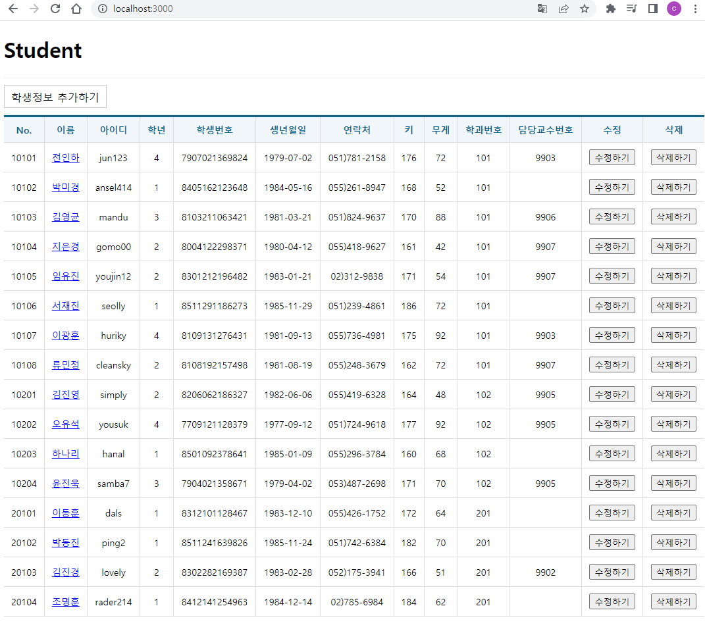
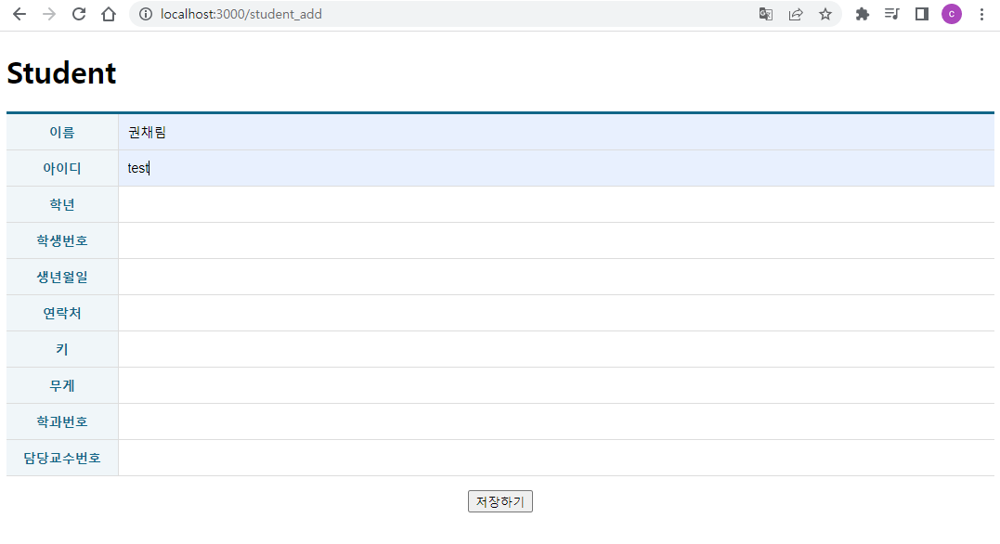
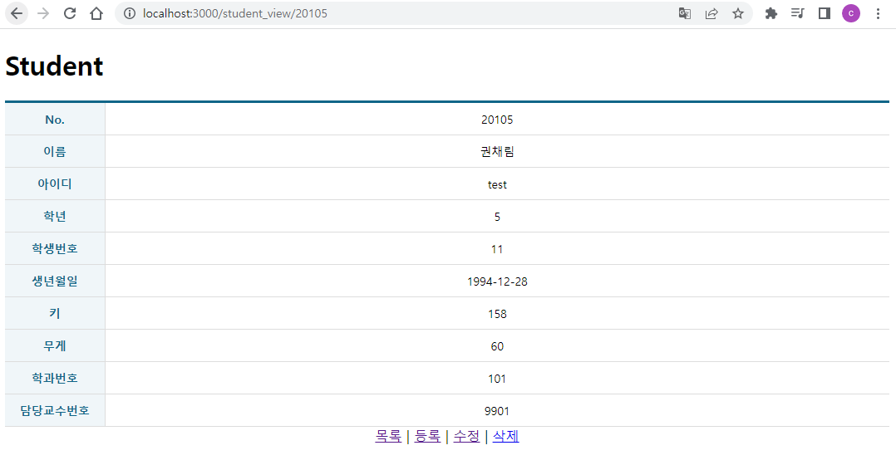
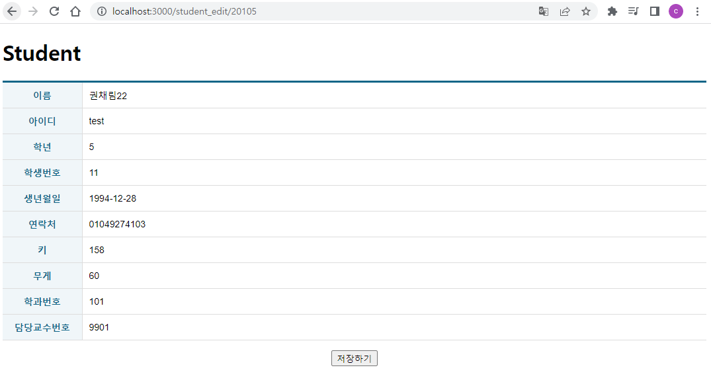
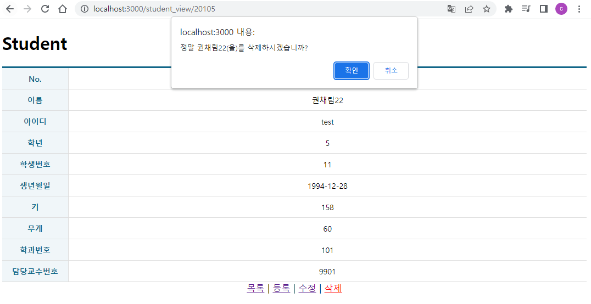

# 권채림 react crud 연습문제

> 2022-11-17

## 문제2 Student 

### App.js
 
 ```javascript
import React, {memo} from 'react';
import {Routes, Route } from "react-router-dom";
import StudentAdd from './pages/StudentAdd';
import StudentEdit from './pages/StudentEdit';
import StudentList from './pages/StudentList';
import StudentView from './pages/StudentView';

const App = memo(() => {
  return (
    <div>
      <h1>Student</h1>
      
      <Routes>
        <Route path='/' exapt={true} element={<StudentList/>}/>
        <Route path='/student_add' element={<StudentAdd/>}/>
        <Route path='/student_view/:id' element={<StudentView/>}/>
        <Route path='/student_edit/:id' element={<StudentEdit/>}/>
      </Routes>
    </div>
  );
})

export default App;
 ```
### index.js
 
 ```javascript
import React from 'react';
import ReactDOM from 'react-dom/client';
// /*
 import App from './App';
/*/
import App from './test';
/**/
import { BrowserRouter } from 'react-router-dom';
import { Provider } from 'react-redux';
import store from './store';

const root = ReactDOM.createRoot(document.getElementById('root'));
root.render(
  <Provider store={store}>
    <BrowserRouter>
      <App />
    </BrowserRouter>
  </Provider>
);


 ```
### store.js
 
 ```javascript
import { configureStore } from "@reduxjs/toolkit";
import StudentSlice from "./slices/StudentSlice";
const store = configureStore({
    reducer: {
        StudentSlice: StudentSlice,
    }
});

export default store;
 ```
### StudentSlice.js
 
 ```javascript
import { createSlice, createAsyncThunk } from '@reduxjs/toolkit'
import axios from 'axios';
import { pending, fulfilled, rejected } from '../helper/ReduxHelper';
import { cloneDeep } from 'lodash';


/** 다중행 데이터 조회를 위한 비동기 함수 */
export const getList = createAsyncThunk("StudentSlice/getList", async (payload, {rejectWithValue }) => {

    let result = null;
    const URL = process.env.REACT_APP_API_STUDENT_LIST;

    try {
        const response = await axios.get(URL);
        result = response.data;
    } catch (err) {
        result = rejectWithValue(err.response);
    }
    return result;
});

/** 단일행 데이터 조회를 위한 비동기 함수 */
export const getItem = createAsyncThunk("StudentSlice/getItem", async (payload, {rejectWithValue }) => {

    let result = null;
    const URL = process.env.REACT_APP_API_STUDENT_ITEM.replace(':id', payload.id);
    console.log(URL);
    try {
        const response = await axios.get(URL);
        result = response.data;
    } catch (err) {
        result = rejectWithValue(err.response);
    }
    return result;
});

/** 데이터 저장을 위한 비동기 함수 */
export const postItem = createAsyncThunk("StudentSlice/postItem", async (payload, {rejectWithValue }) => {

    let result = null;
    const URL = process.env.REACT_APP_API_STUDENT_LIST;

    try {
        const response = await axios.post(URL, {
            name: payload.name,
            userid: payload.userid,
            grade: payload.grade,
            idnum: payload.idnum,
            birthdate: payload.birthdate,
            tel: payload.tel,
            height: payload.height,
            weight: payload.weight,
            deptno: payload.deptno,
            profno: payload.profno,
        });
        result = response.data;
    } catch (err) {
        result = rejectWithValue(err.response);
    }
    return result;
});

/** 데이터 수정을 위한 비동기 함수 */
export const putItem = createAsyncThunk("StudentSlice/putItem", async (payload, {rejectWithValue }) => {

    let result = null;
    const URL = process.env.REACT_APP_API_STUDENT_ITEM.replace(':id', payload.id);

    try {
        const response = await axios.put(URL, {
            name: payload.name,
            userid: payload.userid,
            grade: payload.grade,
            idnum: payload.idnum,
            birthdate: payload.birthdate,
            tel: payload.tel,
            height: payload.height,
            weight: payload.weight,
            deptno: payload.deptno,
            profno: payload.profno,
        });
        result = response.data;
    } catch (err) {
        result = rejectWithValue(err.response);
    }
    return result;
});

/** 데이터 삭제을 위한 비동기 함수 */
export const deleteItem = createAsyncThunk("StudentSlice/deleteItem", async (payload, {rejectWithValue }) => {

    let result = null;
    const URL = process.env.REACT_APP_API_STUDENT_ITEM.replace(':id', payload.id);

    try {
        const response = await axios.delete(URL);
        result = response.data;
    } catch (err) {
        result = rejectWithValue(err.response);
    }
    return result;
});


const StudentSlice = createSlice({
    name: 'StudentSlice',

    initialState: {
        data: null,
        loading: false,
        error: null
    },
    reducers: {
        getCurrentData: (state, action) => {
            return state;
        }
    },
    extraReducers: {
        [getList.pending]: pending,
        [getList.fulfilled]: fulfilled,
        [getList.rejected]: rejected,
        
        [getItem.pending]: pending,
        [getItem.fulfilled]: (state, {meta, payload}) => {
            return {
                data: [payload],
                loading: false,
                error: null
            }
        },
        [getItem.rejected]: rejected,
        
        [postItem.pending]: pending,
        [postItem.fulfilled]: (state, {meta, payload}) => {
            const data = cloneDeep(state.data);
            console.log("data", data);

            data.push(payload);

            return {
                data:data,
                loading: false,
                error: null
            }
        },
        [postItem.rejected]: rejected,

        [deleteItem.pending]: pending,
        [deleteItem.fulfilled]: (state, {meta, payload}) => {
            console.log("meta",meta)
            const data = cloneDeep(state.data);
            const targetId = data.findIndex((v, i) => v.id === Number(meta.arg.id));
            console.log("targetId", targetId);

            data.splice(targetId, 1);

            return {
                data: data,
                loading: false,
                error: null
            }
        },
        [deleteItem.rejected]: rejected,

        [putItem.pending]: pending,
        [putItem.fulfilled]: (state, {meta, payload}) => {
            const data = cloneDeep(state.data);
            const targetId = data.findIndex((v, i) => v.id === Number(meta.arg.id));
            console.log("targetId", targetId);

            data.splice(targetId, 1, payload);

            return {
                data: data,
                loading: false,
                error: null
            }
        },
        [putItem.rejected]: rejected,
    },
});

export const {getCurrentData} = StudentSlice.actions;
export default StudentSlice.reducer;
 ```
### StudentList.js
 
 ```javascript
import React, {memo, useCallback} from 'react';
import { useDispatch, useSelector } from 'react-redux';
import { NavLink, useNavigate } from 'react-router-dom';
import Spinner from '../components/Spinner';
import ErrorView from '../components/ErrorView';
import Table from '../components/Table';
import { deleteItem, getList } from '../slices/StudentSlice';
import styled from 'styled-components';
import dayjs from 'dayjs';


const ControlContainer = styled.form`
    position: sticky;
    top:0;
    background-color: #fff;
    border-top: 1px solid #eee;
    border-bottom: 1px solid #eee;
    padding: 10px 0;

    .controll {
        margin-right: 5px;
        display: inline-block;
        font-size: 16px;
        padding: 7px 10px 5px 10px;
        border: 1px solid #ccc;
    }

    .clickable {
        background-color: #fff;
        color: #000;
        text-decoration: none;
        cursor: pointer;

        &:hover {
            background-color: #06fe06;
        }
        &:active {
            transform: scale(0.9, 0.9);
        }
    }
`

const StudentList = memo(() => {
    const dispatch = useDispatch();
    const {data, loading, error} = useSelector((state) => state.StudentSlice);

    React.useEffect(()=>{
        dispatch(getList())
    },[]);

    const navigate = useNavigate();

    const onStudentItemDelete = useCallback((e) => {
        e.preventDefault();

        const current = e.currentTarget;
        const { id, name} = current.dataset;

        if(window.confirm(`정말 ${name}(을)를 삭제하시겠습니까?`)) {
            dispatch(deleteItem({
                id: id
            }))
        }
    }, []);

    const onStudentEditClick = useCallback((e) => {
        e.preventDefault();

        const current = e.currentTarget;
        const {id} = current.dataset;

        navigate(`/student_edit/${id}`);
    })


    return(
        <div>
            {/* 로딩바 */}
            <Spinner loading={loading}/>
            {/* 추가탭 */}
            <ControlContainer>
                <NavLink to="student_add" className="controll clickable">학생정보 추가하기</NavLink>
            </ControlContainer>
            
            {/* 조회결과 */}
            {error ? (
                <ErrorView error={error}/>
            ) : (
                data && (
                    <Table>
                        <thead>
                            <tr>
                                <th>No.</th>
                                <th>이름</th>
                                <th>아이디</th>
                                <th>학년</th>
                                <th>학생번호</th>
                                <th>생년월일</th>
                                <th>연락처</th>
                                <th>키</th>
                                <th>무게</th>
                                <th>학과번호</th>
                                <th>담당교수번호</th>
                                <th>수정</th>
                                <th>삭제</th>
                            </tr>
                        </thead>
                        <tbody>
                            {
                                data.length > 0 ? (
                                    data.map((v, i) => {
                                        return (
                                            <tr key={v.id}>
                                                <td>{v.id}</td>
                                                <td>
                                                    <NavLink to={`/student_view/${v.id}`}>{v.name}</NavLink>
                                                </td>
                                                <td>{v.userid}</td>
                                                <td>{v.grade}</td>
                                                <td>{v.idnum}</td>
                                                <td>{dayjs(v.birthdate).format('YYYY-MM-DD')}</td>
                                                <td>{v.tel}</td>
                                                <td>{v.height}</td>
                                                <td>{v.weight}</td>
                                                <td>{v.deptno}</td>
                                                <td>{v.profno}</td>
                                                <td>
                                                    <button type='button' data-id = {v.id} data-name={v.name} onClick={onStudentEditClick} >
                                                        수정하기
                                                    </button>
                                                </td>
                                                <td>
                                                    <button type='button' data-id = {v.id} data-name={v.name} onClick={onStudentItemDelete}>
                                                        삭제하기
                                                    </button>
                                                </td>
                                            </tr>
                                        )
                                    })
                                ):(
                                    <tr>
                                        <td colSpan='11' align='center'>검색결과가 없습니다.</td>
                                    </tr>
                                )
                            }
                        </tbody>
                    </Table>
                )
            )}
        </div>
    )
})

export default StudentList;
 ```
### StudentAdd.js
 
 ```javascript
import React, {memo, useCallback} from 'react';
import TableEx from '../components/TableEx';
import { useNavigate } from 'react-router-dom';
import { useSelector, useDispatch } from 'react-redux';
import { postItem } from '../slices/StudentSlice';
import Spinner from '../components/Spinner';
import ErrorView from '../components/ErrorView';


const StudentAdd = memo(() => {
    const navigate = useNavigate();

    const dispatch = useDispatch();
    const { loading, error} = useSelector((state) => state.StudentSlice);

    const onStudentSubmit = useCallback((e)=>{
        e.preventDefault();

        const current = e.currentTarget;

        dispatch(postItem({
            name: current.name.value,
            userid: current.userid.value,
            grade: current.grade.value,
            idnum: current.idnum.value,
            birthdate: current.birthdate.value,
            tel: current.tel.value,
            height: current.height.value,
            weight: current.weight.value,
            deptno: current.deptno.value,
            profno: current.profno.value,
        })).then((result) => {
            console.log("result:",result);
            navigate(`/student_view/${result.payload.id}`);
        })
    }, [])

    return(
        <div>
            <Spinner loading={loading}/>
            {error ? (
                <ErrorView error={error}/>
            ) : (
            <form onSubmit={onStudentSubmit}>
                <TableEx>
                    <colgroup>
                        <col width="120"/>
                        <col/>
                    </colgroup>
                    <tbody>
                        <tr>
                            <th>이름</th>
                            <td className='inputWrapper'>
                                <input className="field" type="text" name="name"/>
                            </td>
                        </tr>
                        <tr>
                            <th>아이디</th>
                                <td className='inputWrapper'>
                                <input className="field" type="text" name="userid"/>
                            </td> 
                        </tr>
                        <tr>
                            <th>학년</th>
                                <td className='inputWrapper'>
                                <input className="field" type="text" name="grade"/>
                            </td> 
                        </tr>
                        <tr>
                            <th>학생번호</th>
                                <td className='inputWrapper'>
                                <input className="field" type="text" name="idnum"/>
                            </td> 
                        </tr>
                        <tr>
                            <th>생년월일</th>
                                <td className='inputWrapper'>
                                <input className="field" type="text" name="birthdate"/>
                            </td> 
                        </tr>
                        <tr>
                            <th>연락처</th>
                                <td className='inputWrapper'>
                                <input className="field" type="text" name="tel"/>
                            </td> 
                        </tr>
                        <tr>
                            <th>키</th>
                                <td className='inputWrapper'>
                                <input className="field" type="text" name="height"/>
                            </td> 
                        </tr>
                        <tr>
                            <th>무게</th>
                                <td className='inputWrapper'>
                                <input className="field" type="text" name="weight"/>
                            </td> 
                        </tr>
                        <tr>
                            <th>학과번호</th>
                                <td className='inputWrapper'>
                                <input className="field" type="text" name="deptno"/>
                            </td> 
                        </tr>
                        <tr>
                            <th>담당교수번호</th>
                                <td className='inputWrapper'>
                                <input className="field" type="text" name="profno"/>
                            </td> 
                        </tr>
                    </tbody>
                </TableEx>

                <div style={{textAlign: 'center'}}>
                    <button type='submit'>저장하기</button>
                </div>
            </form>

            )}
        </div>
    )
})

export default StudentAdd;

 ```
### StudentEdit.js
 
 ```javascript
import React, {memo, useCallback, useEffect, useMemo} from 'react';
import TableEx from '../components/TableEx';
import { useNavigate, useParams } from 'react-router-dom';
import { useSelector, useDispatch } from 'react-redux';
import { getCurrentData, getItem, putItem } from '../slices/StudentSlice';
import Spinner from '../components/Spinner';
import ErrorView from '../components/ErrorView';
import dayjs from 'dayjs';

const StudentEdit = memo(() => {
    const { id } = useParams();

    const dispatch = useDispatch();
    const { data, loading, error} = useSelector((state) => state.StudentSlice);

    useEffect(()=> {
        dispatch(getCurrentData());
    },[]);

    const item = useMemo(() => {
        if(data) {
            return data.find((v, i) => v.id == id);
        } else {
            dispatch(getItem({id:id}));
        }
    }, [data])

    const navigate = useNavigate();

    const onStudentSubmit = useCallback((e)=>{
        e.preventDefault();

        const current = e.currentTarget;
        console.log(current.name.value);
        dispatch(putItem({
            id: current.id.value,
            name: current.name.value,
            userid: current.userid.value,
            grade: current.grade.value,
            idnum: current.idnum.value,
            birthdate: current.birthdate.value,
            tel: current.tel.value,
            height: current.height.value,
            weight: current.weight.value,
            deptno: current.deptno.value,
            profno: current.profno.value,
        })).then((result) => {
            console.log("result:",result);
            navigate(`/student_view/${result.payload.id}`);
        })
    },[])

    return(
        <div>
            <Spinner loading={loading}/>
            {error ? (
                <ErrorView error={error}/>
            ) : (
            <form onSubmit={onStudentSubmit}>
                <input type="hidden" name="id" defaultValue={item?.id} />
                <TableEx>
                    <colgroup>
                        <col width="120"/>
                        <col/>
                    </colgroup>
                    <tbody>
                        <tr>
                            <th>이름</th>
                            <td className='inputWrapper'>
                                <input className="field" type="text" name="name" defaultValue={item?.name}/>
                            </td>
                        </tr>
                        <tr>
                            <th>아이디</th>
                                <td className='inputWrapper'>
                                <input className="field" type="text" name="userid" defaultValue={item?.userid}/>
                            </td> 
                        </tr>
                        <tr>
                            <th>학년</th>
                                <td className='inputWrapper'>
                                <input className="field" type="text" name="grade" defaultValue={item?.grade}/>
                            </td> 
                        </tr>
                        <tr>
                            <th>학생번호</th>
                                <td className='inputWrapper'>
                                <input className="field" type="text" name="idnum" defaultValue={item?.idnum}/>
                            </td> 
                        </tr>
                        <tr>
                            <th>생년월일</th>
                                <td className='inputWrapper'>
                                <input className="field" type="text" name="birthdate" defaultValue={dayjs(item?.birthdate).format('YYYY-MM-DD')}/>
                            </td> 
                        </tr>
                        <tr>
                            <th>연락처</th>
                                <td className='inputWrapper'>
                                <input className="field" type="text" name="tel" defaultValue={item?.tel}/>
                            </td> 
                        </tr>
                        <tr>
                            <th>키</th>
                                <td className='inputWrapper'>
                                <input className="field" type="text" name="height" defaultValue={item?.height}/>
                            </td> 
                        </tr>
                        <tr>
                            <th>무게</th>
                                <td className='inputWrapper'>
                                <input className="field" type="text" name="weight" defaultValue={item?.weight}/>
                            </td> 
                        </tr>
                        <tr>
                            <th>학과번호</th>
                                <td className='inputWrapper'>
                                <input className="field" type="text" name="deptno" defaultValue={item?.deptno}/>
                            </td> 
                        </tr>
                        <tr>
                            <th>담당교수번호</th>
                                <td className='inputWrapper'>
                                <input className="field" type="text" name="profno" defaultValue={item?.profno}/>
                            </td> 
                        </tr>
                    </tbody>
                </TableEx>

                <div style={{textAlign: 'center'}}>
                    <button type='submit'>저장하기</button>
                </div>
            </form>

            )}
        </div>
    )
})

export default StudentEdit;

 ```
### StudnetView.js
 
 ```javascript
import React, {memo, useCallback, useEffect, useMemo} from 'react';
import { NavLink, useParams, useNavigate } from 'react-router-dom';
import { useSelector, useDispatch } from 'react-redux';
import { getCurrentData, deleteItem, getItem } from '../slices/StudentSlice';

import Spinner from '../components/Spinner';
import ErrorView from '../components/ErrorView';
import Table from '../components/Table';
import dayjs from 'dayjs';

const StudentView = memo(() => {
    const {id} = useParams();

    const dispatch = useDispatch();
    const { data, loading, error} = useSelector((state) => state.StudentSlice);

    useEffect(()=>{
        dispatch(getCurrentData());
    }, [])

    
    const item = useMemo(() => {
        if(data) {
            return data.find((v,i)=> v.id == id);
        } else {
            dispatch(getItem({id: id}));
        }
    }, [data]);

    const navigate = useNavigate();

    const onStudentItemDelete = useCallback((e) => {
        e.preventDefault();

        const current = e.currentTarget;
        const { id, name} = current.dataset;

        if(window.confirm(`정말 ${name}(을)를 삭제하시겠습니까?`)) {
            dispatch(deleteItem({
                id: id
            })).then(({meta, payload}) => {
                navigate('/');
            })
        }
    }, []);

    
    return(
        <div>
            <Spinner loading={loading}/>
            {error ? (
                <ErrorView error={error}/>
            ) : (
                item && (
                    <div>
                        <Table>
                            <colgroup>
                                <col width="120"/>
                                <col/>
                            </colgroup>
                            <tbody>
                                <tr>
                                    <th>No.</th>
                                    <td>{item.id}</td> 
                                </tr>
                                <tr>
                                    <th>이름</th>
                                    <td>{item.name}</td> 
                                </tr>
                                <tr>
                                    <th>아이디</th>
                                    <td>{item.userid}</td> 
                                </tr>
                                <tr>
                                    <th>학년</th>
                                    <td>{item.grade}</td> 
                                </tr>
                                <tr>
                                    <th>학생번호</th>
                                    <td>{item.idnum}</td> 
                                </tr>
                                <tr>
                                    <th>생년월일</th>
                                    <td>{dayjs(item.birthdate).format('YYYY-MM-DD')}</td> 
                                </tr>
                                <tr>
                                    <th>키</th>
                                    <td>{item.height}</td> 
                                </tr>
                                <tr>
                                    <th>무게</th>
                                    <td>{item.weight}</td> 
                                </tr>
                                <tr>
                                    <th>학과번호</th>
                                    <td>{item.deptno}</td> 
                                </tr>
                                <tr>
                                    <th>담당교수번호</th>
                                    <td>{item.profno}</td> 
                                </tr>
                            </tbody>
                        </Table>

                        <div style={{textAlign: 'center'}}>
                            <NavLink to="/">목록</NavLink>
                            &nbsp;|&nbsp;
                            <NavLink to="/student_add">등록</NavLink>
                            &nbsp;|&nbsp;
                            <NavLink to={`/student_edit/${item.id}`}>수정</NavLink>
                            &nbsp;|&nbsp;
                            <NavLink to="#!" data-id = {item.id} data-name={item.name} onClick={onStudentItemDelete}>삭제</NavLink>
                            
                        </div>
                    </div>     
                )
            )}
        </div>
    )
})

export default StudentView;


 ```







